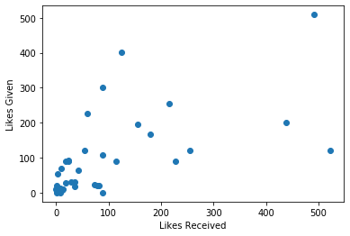

# GroupMe Data Scraping

## To download your GroupMe data, go to your GroupMe profile on the web version.  Click on "Export My Data", then "Create Export".  You can choose which groups and/or direct messages to export.  The data I used for information about likes is in the message.json file.


```python
import pandas as pd

df = pd.read_json('message_physics_trauma.json')

df['like_num'] = df['favorited_by'].apply(len)
df.head()
name_pivtab = pd.pivot_table(df,index='sender_id',columns='name',aggfunc='count').fillna(0)

def get_max_name(s):
    if s in name_pivtab.T:
        return name_pivtab.T[s].idxmax()[1]
    else:
        return s
df['Name'] = df['sender_id'].apply(get_max_name)

df_likes = df.groupby('Name')['like_num'].agg('sum').sort_values(ascending = False)

df_likes = pd.DataFrame(df_likes)
df_likes
```


<div>
<style scoped>
    .dataframe tbody tr th:only-of-type {
        vertical-align: middle;
    }

    .dataframe tbody tr th {
        vertical-align: top;
    }

    .dataframe thead th {
        text-align: right;
    }
</style>
<table border="1" class="dataframe">
  <thead>
    <tr style="text-align: right;">
      <th></th>
      <th>like_num</th>
    </tr>
    <tr>
      <th>Name</th>
      <th></th>
    </tr>
  </thead>
  <tbody>
    <tr>
      <th>Guillermo Suarez</th>
      <td>522</td>
    </tr>
    <tr>
      <th>Tau Neutrino Tommy</th>
      <td>492</td>
    </tr>
    <tr>
      <th>Dan Le</th>
      <td>438</td>
    </tr>
    <tr>
      <th>Dabiano Peruana</th>
      <td>255</td>
    </tr>
    <tr>
      <th>Nolan King</th>
      <td>227</td>
    </tr>
    <tr>
      <th>Dwayne "Dirac" Johnson</th>
      <td>215</td>
    </tr>
    <tr>
      <th>Raj Patel</th>
      <td>180</td>
    </tr>
    <tr>
      <th>Austen Adams</th>
      <td>155</td>
    </tr>
    <tr>
      <th>DiPaul Moment</th>
      <td>124</td>
    </tr>
    <tr>
      <th>Bobby Fischer</th>
      <td>115</td>
    </tr>
    <tr>
      <th>Charm Quark Chels</th>
      <td>89</td>
    </tr>
    <tr>
      <th>Bojana Ivanic</th>
      <td>88</td>
    </tr>
    <tr>
      <th>GroupMe</th>
      <td>88</td>
    </tr>
    <tr>
      <th>Jacob Davis</th>
      <td>81</td>
    </tr>
    <tr>
      <th>Spence Norwood</th>
      <td>79</td>
    </tr>
    <tr>
      <th>Juantum Physics</th>
      <td>74</td>
    </tr>
    <tr>
      <th>Rafael Josh</th>
      <td>59</td>
    </tr>
    <tr>
      <th>John H</th>
      <td>55</td>
    </tr>
    <tr>
      <th>Shadnus Karlsen</th>
      <td>43</td>
    </tr>
    <tr>
      <th>Patrick Koch</th>
      <td>35</td>
    </tr>
    <tr>
      <th>Christopher Mcnally</th>
      <td>35</td>
    </tr>
    <tr>
      <th>Ian Grey</th>
      <td>29</td>
    </tr>
    <tr>
      <th>Ben Micklich</th>
      <td>23</td>
    </tr>
    <tr>
      <th>James Mulhern</th>
      <td>23</td>
    </tr>
    <tr>
      <th>Corinne Blangy</th>
      <td>19</td>
    </tr>
    <tr>
      <th>LucasEddy</th>
      <td>18</td>
    </tr>
    <tr>
      <th>Davis Zackaria</th>
      <td>14</td>
    </tr>
    <tr>
      <th>Moutaz Haq</th>
      <td>12</td>
    </tr>
    <tr>
      <th>Maia Little</th>
      <td>10</td>
    </tr>
    <tr>
      <th>Melissa Delk</th>
      <td>10</td>
    </tr>
    <tr>
      <th>Nizam Hasanov</th>
      <td>8</td>
    </tr>
    <tr>
      <th>Pedro Brea</th>
      <td>8</td>
    </tr>
    <tr>
      <th>Alex Towler</th>
      <td>3</td>
    </tr>
    <tr>
      <th>Gavin Rubin</th>
      <td>2</td>
    </tr>
    <tr>
      <th>Zachary Clowdus</th>
      <td>2</td>
    </tr>
    <tr>
      <th>David Chaps</th>
      <td>1</td>
    </tr>
    <tr>
      <th>GroupMe Calendar</th>
      <td>1</td>
    </tr>
    <tr>
      <th>Nathan Rife</th>
      <td>1</td>
    </tr>
    <tr>
      <th>Josey Williams</th>
      <td>0</td>
    </tr>
  </tbody>
</table>
</div>


### Now that we have the number of likes received, we can figure out the number of likes given and compare them.


```python
def get_max_name_list(l):
    l_new=list()
    for s in l:
        l_new.append(get_max_name(s))
    return l_new
df['liked_by_names'] = df['favorited_by'].apply(get_max_name_list)
df['liked_by_names']
liked_series = df[df['like_num']>0]
liked_series['liked_by_names']

id_name_dict = {}
for sender_id in df['sender_id'].unique():
    id_name_dict[sender_id] = get_max_name(sender_id)
    

```


```python
df_likes_given = df.groupby('Name')['created_at'].agg('count')
df_likes_given = pd.DataFrame(df_likes_given)

def likes_given(s):
    return sum([1*(s in name) for name in liked_series['liked_by_names']])


df_likes_given['Name'] = df_likes_given.index.values
df_likes_given['likes_given'] = df_likes_given['Name'].apply(likes_given)
df_likes_given = df_likes_given.drop('Name',axis=1)

```


```python
df_likes_proportion = pd.merge(df_likes_given,df_likes,left_on = 'Name',right_on = 'Name')
df_likes_proportion = df_likes_proportion.rename(columns = {'created_at':'messages','like_num':'likes'})
df_likes_proportion['likes_per_messages'] = df_likes_proportion['likes']/df_likes_proportion['messages']
df_likes_proportion['likes_per_messages'].sort_values(ascending=False)
df_likes_proportion['ratio_of_received_to_given'] = df_likes_proportion['likes']/df_likes_proportion['likes_given']
df_likes_proportion = df_likes_proportion.sort_values(by = 'likes', ascending = False)
df_likes_proportion
```


<div>
<style scoped>
    .dataframe tbody tr th:only-of-type {
        vertical-align: middle;
    }

    .dataframe tbody tr th {
        vertical-align: top;
    }

    .dataframe thead th {
        text-align: right;
    }
</style>
<table border="1" class="dataframe">
  <thead>
    <tr style="text-align: right;">
      <th></th>
      <th>messages</th>
      <th>likes_given</th>
      <th>likes</th>
      <th>likes_per_messages</th>
      <th>ratio_of_received_to_given</th>
    </tr>
    <tr>
      <th>Name</th>
      <th></th>
      <th></th>
      <th></th>
      <th></th>
      <th></th>
    </tr>
  </thead>
  <tbody>
    <tr>
      <th>Guillermo Suarez</th>
      <td>317</td>
      <td>120</td>
      <td>522</td>
      <td>1.646688</td>
      <td>4.350000</td>
    </tr>
    <tr>
      <th>Tau Neutrino Tommy</th>
      <td>313</td>
      <td>509</td>
      <td>492</td>
      <td>1.571885</td>
      <td>0.966601</td>
    </tr>
    <tr>
      <th>Dan Le</th>
      <td>561</td>
      <td>201</td>
      <td>438</td>
      <td>0.780749</td>
      <td>2.179104</td>
    </tr>
    <tr>
      <th>Dabiano Peruana</th>
      <td>146</td>
      <td>122</td>
      <td>255</td>
      <td>1.746575</td>
      <td>2.090164</td>
    </tr>
    <tr>
      <th>Nolan King</th>
      <td>135</td>
      <td>89</td>
      <td>227</td>
      <td>1.681481</td>
      <td>2.550562</td>
    </tr>
    <tr>
      <th>Dwayne "Dirac" Johnson</th>
      <td>306</td>
      <td>254</td>
      <td>215</td>
      <td>0.702614</td>
      <td>0.846457</td>
    </tr>
    <tr>
      <th>Raj Patel</th>
      <td>256</td>
      <td>166</td>
      <td>180</td>
      <td>0.703125</td>
      <td>1.084337</td>
    </tr>
    <tr>
      <th>Austen Adams</th>
      <td>65</td>
      <td>195</td>
      <td>155</td>
      <td>2.384615</td>
      <td>0.794872</td>
    </tr>
    <tr>
      <th>DiPaul Moment</th>
      <td>124</td>
      <td>401</td>
      <td>124</td>
      <td>1.000000</td>
      <td>0.309227</td>
    </tr>
    <tr>
      <th>Bobby Fischer</th>
      <td>75</td>
      <td>90</td>
      <td>115</td>
      <td>1.533333</td>
      <td>1.277778</td>
    </tr>
    <tr>
      <th>Charm Quark Chels</th>
      <td>96</td>
      <td>300</td>
      <td>89</td>
      <td>0.927083</td>
      <td>0.296667</td>
    </tr>
    <tr>
      <th>Bojana Ivanic</th>
      <td>116</td>
      <td>108</td>
      <td>88</td>
      <td>0.758621</td>
      <td>0.814815</td>
    </tr>
    <tr>
      <th>GroupMe</th>
      <td>114</td>
      <td>0</td>
      <td>88</td>
      <td>0.771930</td>
      <td>inf</td>
    </tr>
    <tr>
      <th>Jacob Davis</th>
      <td>22</td>
      <td>21</td>
      <td>81</td>
      <td>3.681818</td>
      <td>3.857143</td>
    </tr>
    <tr>
      <th>Spence Norwood</th>
      <td>66</td>
      <td>20</td>
      <td>79</td>
      <td>1.196970</td>
      <td>3.950000</td>
    </tr>
    <tr>
      <th>Juantum Physics</th>
      <td>36</td>
      <td>24</td>
      <td>74</td>
      <td>2.055556</td>
      <td>3.083333</td>
    </tr>
    <tr>
      <th>Rafael Josh</th>
      <td>48</td>
      <td>226</td>
      <td>59</td>
      <td>1.229167</td>
      <td>0.261062</td>
    </tr>
    <tr>
      <th>John H</th>
      <td>81</td>
      <td>120</td>
      <td>55</td>
      <td>0.679012</td>
      <td>0.458333</td>
    </tr>
    <tr>
      <th>Shadnus Karlsen</th>
      <td>17</td>
      <td>65</td>
      <td>43</td>
      <td>2.529412</td>
      <td>0.661538</td>
    </tr>
    <tr>
      <th>Christopher Mcnally</th>
      <td>39</td>
      <td>30</td>
      <td>35</td>
      <td>0.897436</td>
      <td>1.166667</td>
    </tr>
    <tr>
      <th>Patrick Koch</th>
      <td>28</td>
      <td>19</td>
      <td>35</td>
      <td>1.250000</td>
      <td>1.842105</td>
    </tr>
    <tr>
      <th>Ian Grey</th>
      <td>68</td>
      <td>31</td>
      <td>29</td>
      <td>0.426471</td>
      <td>0.935484</td>
    </tr>
    <tr>
      <th>James Mulhern</th>
      <td>8</td>
      <td>92</td>
      <td>23</td>
      <td>2.875000</td>
      <td>0.250000</td>
    </tr>
    <tr>
      <th>Ben Micklich</th>
      <td>7</td>
      <td>90</td>
      <td>23</td>
      <td>3.285714</td>
      <td>0.255556</td>
    </tr>
    <tr>
      <th>Corinne Blangy</th>
      <td>8</td>
      <td>91</td>
      <td>19</td>
      <td>2.375000</td>
      <td>0.208791</td>
    </tr>
    <tr>
      <th>LucasEddy</th>
      <td>18</td>
      <td>27</td>
      <td>18</td>
      <td>1.000000</td>
      <td>0.666667</td>
    </tr>
    <tr>
      <th>Davis Zackaria</th>
      <td>12</td>
      <td>10</td>
      <td>14</td>
      <td>1.166667</td>
      <td>1.400000</td>
    </tr>
    <tr>
      <th>Moutaz Haq</th>
      <td>4</td>
      <td>8</td>
      <td>12</td>
      <td>3.000000</td>
      <td>1.500000</td>
    </tr>
    <tr>
      <th>Maia Little</th>
      <td>1</td>
      <td>70</td>
      <td>10</td>
      <td>10.000000</td>
      <td>0.142857</td>
    </tr>
    <tr>
      <th>Melissa Delk</th>
      <td>7</td>
      <td>11</td>
      <td>10</td>
      <td>1.428571</td>
      <td>0.909091</td>
    </tr>
    <tr>
      <th>Pedro Brea</th>
      <td>2</td>
      <td>12</td>
      <td>8</td>
      <td>4.000000</td>
      <td>0.666667</td>
    </tr>
    <tr>
      <th>Nizam Hasanov</th>
      <td>10</td>
      <td>0</td>
      <td>8</td>
      <td>0.800000</td>
      <td>inf</td>
    </tr>
    <tr>
      <th>Alex Towler</th>
      <td>1</td>
      <td>55</td>
      <td>3</td>
      <td>3.000000</td>
      <td>0.054545</td>
    </tr>
    <tr>
      <th>Gavin Rubin</th>
      <td>10</td>
      <td>21</td>
      <td>2</td>
      <td>0.200000</td>
      <td>0.095238</td>
    </tr>
    <tr>
      <th>Zachary Clowdus</th>
      <td>3</td>
      <td>10</td>
      <td>2</td>
      <td>0.666667</td>
      <td>0.200000</td>
    </tr>
    <tr>
      <th>Nathan Rife</th>
      <td>8</td>
      <td>5</td>
      <td>1</td>
      <td>0.125000</td>
      <td>0.200000</td>
    </tr>
    <tr>
      <th>GroupMe Calendar</th>
      <td>1</td>
      <td>0</td>
      <td>1</td>
      <td>1.000000</td>
      <td>inf</td>
    </tr>
    <tr>
      <th>David Chaps</th>
      <td>2</td>
      <td>6</td>
      <td>1</td>
      <td>0.500000</td>
      <td>0.166667</td>
    </tr>
    <tr>
      <th>Josey Williams</th>
      <td>2</td>
      <td>11</td>
      <td>0</td>
      <td>0.000000</td>
      <td>0.000000</td>
    </tr>
  </tbody>
</table>
</div>


### A quick scatterplot shows that the number of likes given and likes received tends to be positively correlated, indicating that group members that are active in the chat both like messages and have their messages liked.


```python
import matplotlib.pyplot as plt
plt.scatter(df_likes_proportion['likes'],df_likes_proportion['likes_given'])
plt.xlabel('Likes Received')
plt.ylabel('Likes Given')
plt.show()
```





### This code creates a "biggest fan" attribute, which determines who has liked the most of each person's messages.


```python
import numpy as np
liked_df_group = liked_series.groupby('Name')

def get_likes_in_group(s, name):
    return sum([1*(name in group) for group in np.array(liked_df_group.get_group(s)['liked_by_names'])])
def get_favorites(s):
    if s in list(liked_series['Name']):
        liked_by_array = np.array(liked_df_group.get_group(s)['liked_by_names'])
        names_list = list()
        num_messages_liked = list()
        for name in df_likes_proportion.index.values:
            names_list.append(name)
            num_messages_liked.append(get_likes_in_group(s,name))
        index = pd.Series(num_messages_liked).idxmax()
        return (names_list[index], int(num_messages_liked[index]))
    else:
        return ''
df_likes_proportion['Name'] = df_likes_proportion.index.values
df_likes_proportion['biggest_fan'] = df_likes_proportion['Name'].apply(get_favorites)
df_likes_proportion = df_likes_proportion.drop('Name',axis=1)
df_likes_proportion

```


<div>
<style scoped>
    .dataframe tbody tr th:only-of-type {
        vertical-align: middle;
    }

    .dataframe tbody tr th {
        vertical-align: top;
    }

    .dataframe thead th {
        text-align: right;
    }
</style>
<table border="1" class="dataframe">
  <thead>
    <tr style="text-align: right;">
      <th></th>
      <th>messages</th>
      <th>likes_given</th>
      <th>likes</th>
      <th>likes_per_messages</th>
      <th>ratio_of_received_to_given</th>
      <th>biggest_fan</th>
    </tr>
    <tr>
      <th>Name</th>
      <th></th>
      <th></th>
      <th></th>
      <th></th>
      <th></th>
      <th></th>
    </tr>
  </thead>
  <tbody>
    <tr>
      <th>Guillermo Suarez</th>
      <td>317</td>
      <td>120</td>
      <td>522</td>
      <td>1.646688</td>
      <td>4.350000</td>
      <td>(Tau Neutrino Tommy, 80)</td>
    </tr>
    <tr>
      <th>Tau Neutrino Tommy</th>
      <td>313</td>
      <td>509</td>
      <td>492</td>
      <td>1.571885</td>
      <td>0.966601</td>
      <td>(DiPaul Moment, 78)</td>
    </tr>
    <tr>
      <th>Dan Le</th>
      <td>561</td>
      <td>201</td>
      <td>438</td>
      <td>0.780749</td>
      <td>2.179104</td>
      <td>(DiPaul Moment, 71)</td>
    </tr>
    <tr>
      <th>Dabiano Peruana</th>
      <td>146</td>
      <td>122</td>
      <td>255</td>
      <td>1.746575</td>
      <td>2.090164</td>
      <td>(Tau Neutrino Tommy, 43)</td>
    </tr>
    <tr>
      <th>Nolan King</th>
      <td>135</td>
      <td>89</td>
      <td>227</td>
      <td>1.681481</td>
      <td>2.550562</td>
      <td>(Charm Quark Chels, 38)</td>
    </tr>
    <tr>
      <th>Dwayne "Dirac" Johnson</th>
      <td>306</td>
      <td>254</td>
      <td>215</td>
      <td>0.702614</td>
      <td>0.846457</td>
      <td>(Tau Neutrino Tommy, 42)</td>
    </tr>
    <tr>
      <th>Raj Patel</th>
      <td>256</td>
      <td>166</td>
      <td>180</td>
      <td>0.703125</td>
      <td>1.084337</td>
      <td>(DiPaul Moment, 43)</td>
    </tr>
    <tr>
      <th>Austen Adams</th>
      <td>65</td>
      <td>195</td>
      <td>155</td>
      <td>2.384615</td>
      <td>0.794872</td>
      <td>(Tau Neutrino Tommy, 19)</td>
    </tr>
    <tr>
      <th>DiPaul Moment</th>
      <td>124</td>
      <td>401</td>
      <td>124</td>
      <td>1.000000</td>
      <td>0.309227</td>
      <td>(Tau Neutrino Tommy, 27)</td>
    </tr>
    <tr>
      <th>Bobby Fischer</th>
      <td>75</td>
      <td>90</td>
      <td>115</td>
      <td>1.533333</td>
      <td>1.277778</td>
      <td>(DiPaul Moment, 20)</td>
    </tr>
    <tr>
      <th>Charm Quark Chels</th>
      <td>96</td>
      <td>300</td>
      <td>89</td>
      <td>0.927083</td>
      <td>0.296667</td>
      <td>(Tau Neutrino Tommy, 16)</td>
    </tr>
    <tr>
      <th>Bojana Ivanic</th>
      <td>116</td>
      <td>108</td>
      <td>88</td>
      <td>0.758621</td>
      <td>0.814815</td>
      <td>(Dwayne "Dirac" Johnson, 26)</td>
    </tr>
    <tr>
      <th>GroupMe</th>
      <td>114</td>
      <td>0</td>
      <td>88</td>
      <td>0.771930</td>
      <td>inf</td>
      <td>(Tau Neutrino Tommy, 25)</td>
    </tr>
    <tr>
      <th>Jacob Davis</th>
      <td>22</td>
      <td>21</td>
      <td>81</td>
      <td>3.681818</td>
      <td>3.857143</td>
      <td>(Dwayne "Dirac" Johnson, 8)</td>
    </tr>
    <tr>
      <th>Spence Norwood</th>
      <td>66</td>
      <td>20</td>
      <td>79</td>
      <td>1.196970</td>
      <td>3.950000</td>
      <td>(Tau Neutrino Tommy, 21)</td>
    </tr>
    <tr>
      <th>Juantum Physics</th>
      <td>36</td>
      <td>24</td>
      <td>74</td>
      <td>2.055556</td>
      <td>3.083333</td>
      <td>(DiPaul Moment, 20)</td>
    </tr>
    <tr>
      <th>Rafael Josh</th>
      <td>48</td>
      <td>226</td>
      <td>59</td>
      <td>1.229167</td>
      <td>0.261062</td>
      <td>(DiPaul Moment, 11)</td>
    </tr>
    <tr>
      <th>John H</th>
      <td>81</td>
      <td>120</td>
      <td>55</td>
      <td>0.679012</td>
      <td>0.458333</td>
      <td>(Tau Neutrino Tommy, 20)</td>
    </tr>
    <tr>
      <th>Shadnus Karlsen</th>
      <td>17</td>
      <td>65</td>
      <td>43</td>
      <td>2.529412</td>
      <td>0.661538</td>
      <td>(Dabiano Peruana, 9)</td>
    </tr>
    <tr>
      <th>Christopher Mcnally</th>
      <td>39</td>
      <td>30</td>
      <td>35</td>
      <td>0.897436</td>
      <td>1.166667</td>
      <td>(Tau Neutrino Tommy, 7)</td>
    </tr>
    <tr>
      <th>Patrick Koch</th>
      <td>28</td>
      <td>19</td>
      <td>35</td>
      <td>1.250000</td>
      <td>1.842105</td>
      <td>(Tau Neutrino Tommy, 4)</td>
    </tr>
    <tr>
      <th>Ian Grey</th>
      <td>68</td>
      <td>31</td>
      <td>29</td>
      <td>0.426471</td>
      <td>0.935484</td>
      <td>(Charm Quark Chels, 9)</td>
    </tr>
    <tr>
      <th>James Mulhern</th>
      <td>8</td>
      <td>92</td>
      <td>23</td>
      <td>2.875000</td>
      <td>0.250000</td>
      <td>(Tau Neutrino Tommy, 3)</td>
    </tr>
    <tr>
      <th>Ben Micklich</th>
      <td>7</td>
      <td>90</td>
      <td>23</td>
      <td>3.285714</td>
      <td>0.255556</td>
      <td>(Dwayne "Dirac" Johnson, 5)</td>
    </tr>
    <tr>
      <th>Corinne Blangy</th>
      <td>8</td>
      <td>91</td>
      <td>19</td>
      <td>2.375000</td>
      <td>0.208791</td>
      <td>(Tau Neutrino Tommy, 4)</td>
    </tr>
    <tr>
      <th>LucasEddy</th>
      <td>18</td>
      <td>27</td>
      <td>18</td>
      <td>1.000000</td>
      <td>0.666667</td>
      <td>(Charm Quark Chels, 4)</td>
    </tr>
    <tr>
      <th>Davis Zackaria</th>
      <td>12</td>
      <td>10</td>
      <td>14</td>
      <td>1.166667</td>
      <td>1.400000</td>
      <td>(DiPaul Moment, 3)</td>
    </tr>
    <tr>
      <th>Moutaz Haq</th>
      <td>4</td>
      <td>8</td>
      <td>12</td>
      <td>3.000000</td>
      <td>1.500000</td>
      <td>(Dwayne "Dirac" Johnson, 2)</td>
    </tr>
    <tr>
      <th>Maia Little</th>
      <td>1</td>
      <td>70</td>
      <td>10</td>
      <td>10.000000</td>
      <td>0.142857</td>
      <td>(Tau Neutrino Tommy, 1)</td>
    </tr>
    <tr>
      <th>Melissa Delk</th>
      <td>7</td>
      <td>11</td>
      <td>10</td>
      <td>1.428571</td>
      <td>0.909091</td>
      <td>(Tau Neutrino Tommy, 2)</td>
    </tr>
    <tr>
      <th>Pedro Brea</th>
      <td>2</td>
      <td>12</td>
      <td>8</td>
      <td>4.000000</td>
      <td>0.666667</td>
      <td>(Dwayne "Dirac" Johnson, 2)</td>
    </tr>
    <tr>
      <th>Nizam Hasanov</th>
      <td>10</td>
      <td>0</td>
      <td>8</td>
      <td>0.800000</td>
      <td>inf</td>
      <td>(Charm Quark Chels, 5)</td>
    </tr>
    <tr>
      <th>Alex Towler</th>
      <td>1</td>
      <td>55</td>
      <td>3</td>
      <td>3.000000</td>
      <td>0.054545</td>
      <td>(Tau Neutrino Tommy, 1)</td>
    </tr>
    <tr>
      <th>Gavin Rubin</th>
      <td>10</td>
      <td>21</td>
      <td>2</td>
      <td>0.200000</td>
      <td>0.095238</td>
      <td>(Dabiano Peruana, 1)</td>
    </tr>
    <tr>
      <th>Zachary Clowdus</th>
      <td>3</td>
      <td>10</td>
      <td>2</td>
      <td>0.666667</td>
      <td>0.200000</td>
      <td>(Tau Neutrino Tommy, 1)</td>
    </tr>
    <tr>
      <th>Nathan Rife</th>
      <td>8</td>
      <td>5</td>
      <td>1</td>
      <td>0.125000</td>
      <td>0.200000</td>
      <td>(Dan Le, 1)</td>
    </tr>
    <tr>
      <th>GroupMe Calendar</th>
      <td>1</td>
      <td>0</td>
      <td>1</td>
      <td>1.000000</td>
      <td>inf</td>
      <td>(Bobby Fischer, 1)</td>
    </tr>
    <tr>
      <th>David Chaps</th>
      <td>2</td>
      <td>6</td>
      <td>1</td>
      <td>0.500000</td>
      <td>0.166667</td>
      <td>(Dwayne "Dirac" Johnson, 1)</td>
    </tr>
    <tr>
      <th>Josey Williams</th>
      <td>2</td>
      <td>11</td>
      <td>0</td>
      <td>0.000000</td>
      <td>0.000000</td>
      <td></td>
    </tr>
  </tbody>
</table>
</div>


